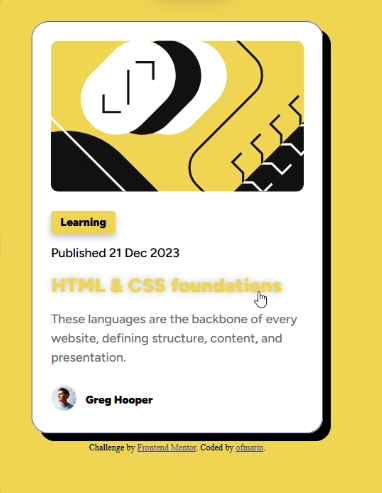

# Frontend Mentor - Blog preview card solution

This is a solution to the [Blog preview card challenge on Frontend Mentor](https://www.frontendmentor.io/challenges/blog-preview-card-ckPaj01IcS). Frontend Mentor challenges help you improve your coding skills by building realistic projects.

## Table of contents

- [Overview](#overview)
  - [The challenge](#the-challenge)
  - [Screenshot](#screenshot)
  - [Links](#links)
- [My process](#my-process)
  - [Built with](#built-with)
  - [What I learned](#what-i-learned)
  - [Continued development](#continued-development)
  - [Useful resources](#useful-resources)
  - [AI Collaboration](#ai-collaboration)
- [Author](#author)
- [Acknowledgments](#acknowledgments)

**Note: Delete this note and update the table of contents based on what sections you keep.**

## Overview

### The challenge

Users should be able to:

- See hover and focus states for all interactive elements on the page

### Screenshot

Any problem with screenshot quality, direct complains to Greg hooper, not Ofmarin.

Add a screenshot of your solution. The easiest way to do this is to use Firefox to view your project, right-click the page and select "Take a Screenshot". You can choose either a full-height screenshot or a cropped one based on how long the page is. If it's very long, it might be best to crop it.

Alternatively, you can use a tool like [FireShot](https://getfireshot.com/) to take the screenshot. FireShot has a free option, so you don't need to purchase it.

Then crop/optimize/edit your image however you like, add it to your project, and update the file path in the image above.

**Note: Delete this note and the paragraphs above when you add your screenshot. If you prefer not to add a screenshot, feel free to remove this entire section.**

### Links

- Solution URL: [Add solution URL here](https://github.com/ofmarin/blog-preview-card)
- Live Site URL: [Add live site URL here](https://ofmarin.github.io/blog-preview-card/)

## My process

### Built with

- Semantic HTML5 markup
- CSS
- Flexbox
- [Angular](https://angular.dev/) - TS Framework

### What I learned

- I learned about webkit although it also learned it is legacy.
- Got more CSS vocabulary into my brain.
- Learned about ng generate commands
- Leveled up patience a bit more after commiting -am many times to tweak font sizes.

### Continued development

Will keep focusing on learning a lot about angular, but for sure it seems that CSS is the
things that takes more of my patience and time.

### Useful resources

- [Stackoverflow](https://stackoverflow.com/) - sometimes gemini will suck synthetising info or understand the solution didnt work, so its better going directly to the source.
- [Github](https://www.github.com) - github forums also had some cool answers for some questions

### AI Collaboration

- practically replaced google searches for basic CSS questions.
- Still there are times when its better to go to stackoverflow and documentation like I mentioned in the last section.
- works well showing basic code, but when I needed a solution to go into configuration it wasn't very clear.
- Best to use it as a helper not a problem solving tool.

## Author

- Frontend Mentor - [@ofmarin](https://www.frontendmentor.io/profile/ofmarin)

## Acknowledgments

- God, Jesus Christ and the Holy Spirit for keeping me sane in an insane reality.
- Gemini although its mentioned in AI collaboration.
